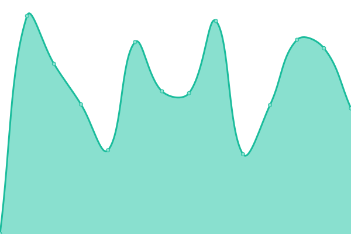
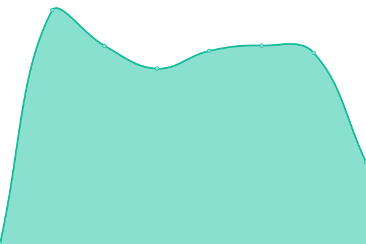
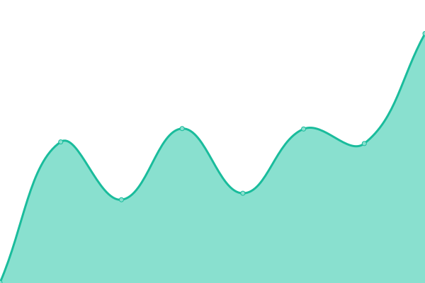
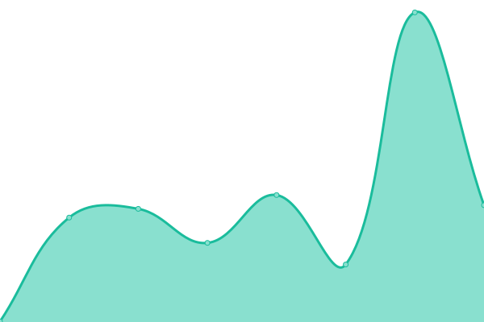
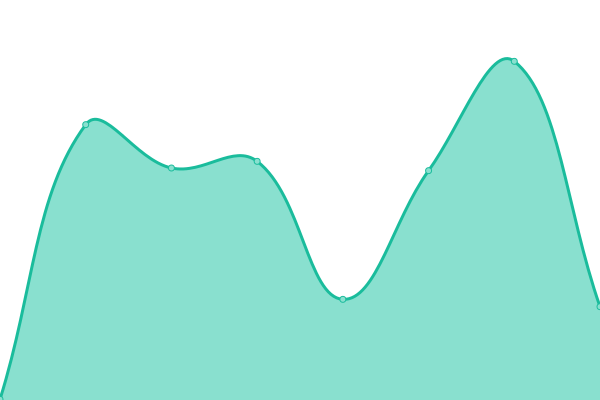
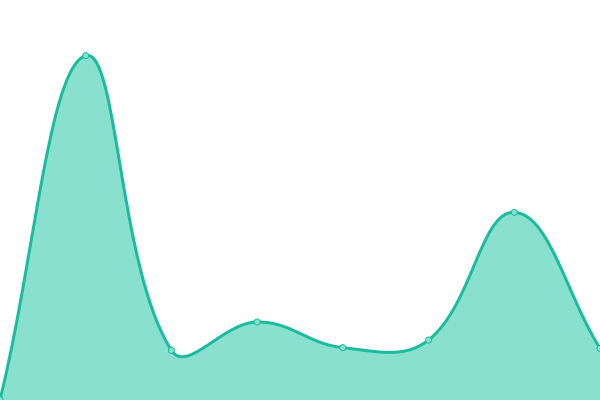
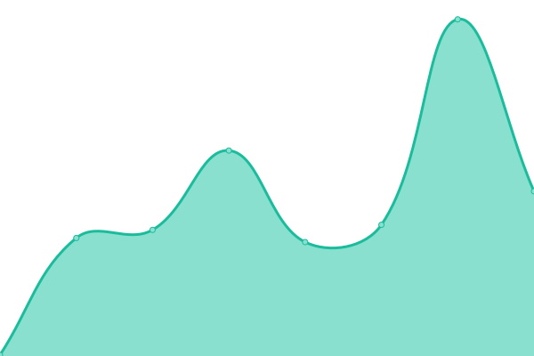
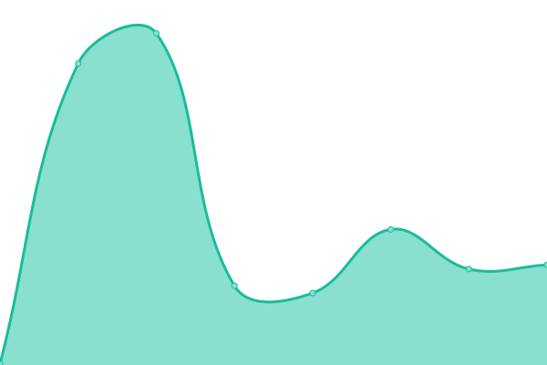
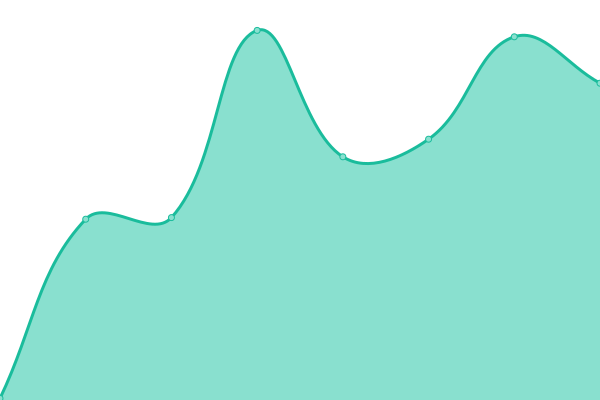
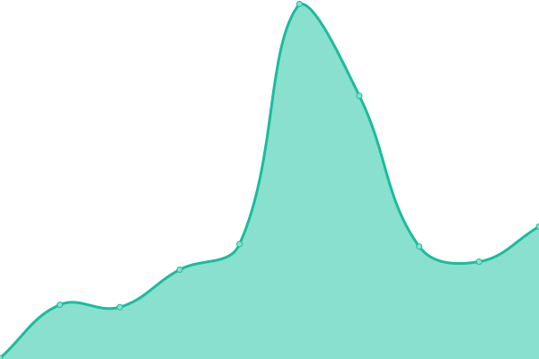

# [📈 Live Status](https://status.rda.run): <!--live status--> **🟧 Partial outage**

This repository contains the open-source uptime monitor and status page for [rda.run](https://rda.run), powered by [Upptime](https://github.com/upptime/upptime).

With [Upptime](https://upptime.js.org), you can get your own unlimited and free uptime monitor and status page, powered entirely by a GitHub repository. We use [Issues](https://github.com/rda-run/upptime/issues) as incident reports, [Actions](https://github.com/rda-run/upptime/actions) as uptime monitors, and [Pages](https://status.rda.run) for the status page.

<!--start: status pages-->
<!-- This summary is generated by Upptime (https://github.com/upptime/upptime) -->
<!-- Do not edit this manually, your changes will be overwritten -->
<!-- prettier-ignore -->
| URL | Status | History | Response Time | Uptime |
| --- | ------ | ------- | ------------- | ------ |
|  [Vault](https://vault.rda.run/v1/sys/health) | 🟩 Up | [vault.yml](https://github.com/rda-run/upptime/commits/HEAD/history/vault.yml) | 

 411ms
     
 | 

<a href="https://status.rda.run/history/vault">23.59%</a>
    

|  [Passwords](https://passwords.rda.run/alive) | 🟩 Up | [passwords.yml](https://github.com/rda-run/upptime/commits/HEAD/history/passwords.yml) | 

 249ms
     
 | 

<a href="https://status.rda.run/history/passwords">23.58%</a>
    

|  [Links](https://link.rda.run) | 🟩 Up | [links.yml](https://github.com/rda-run/upptime/commits/HEAD/history/links.yml) | 

 162ms
     
 | 

<a href="https://status.rda.run/history/links">23.54%</a>
    

|  [Clear Address](https://clear-address.rda.run/v1/rdeavila@gmail.com) | 🟥 Down | [clear-address.yml](https://github.com/rda-run/upptime/commits/HEAD/history/clear-address.yml) | 

 350ms
     
 | 

<a href="https://status.rda.run/history/clear-address">23.39%</a>
    

|  [Mirrors](https://mirrors.rda.run/almalinux/timestamp.txt) | 🟩 Up | [mirrors.yml](https://github.com/rda-run/upptime/commits/HEAD/history/mirrors.yml) | 

 418ms
     
 | 

<a href="https://status.rda.run/history/mirrors">76.58%</a>
    

|  [Mirror Report Service](https://mirrors-report.rda.run) | 🟩 Up | [mirror-report-service.yml](https://github.com/rda-run/upptime/commits/HEAD/history/mirror-report-service.yml) | 

 187ms
     
 | 

<a href="https://status.rda.run/history/mirror-report-service">25.35%</a>
    

|  [RPM](https://rpm.rda.run) | 🟩 Up | [rpm.yml](https://github.com/rda-run/upptime/commits/HEAD/history/rpm.yml) | 

 195ms
     
 | 

<a href="https://status.rda.run/history/rpm">23.45%</a>
    

|  [Link Shortener](https://l.rda.run) | 🟩 Up | [link-shortener.yml](https://github.com/rda-run/upptime/commits/HEAD/history/link-shortener.yml) | 

 190ms
     
 | 

<a href="https://status.rda.run/history/link-shortener">23.42%</a>
    

|  [CSPRNG Service](https://csprng.rda.run/v1/api) | 🟩 Up | [csprng-service.yml](https://github.com/rda-run/upptime/commits/HEAD/history/csprng-service.yml) | 

 100ms
     
 | 

<a href="https://status.rda.run/history/csprng-service">23.40%</a>
    

|  [Knowledge base](https://docs.rda.run) | 🟩 Up | [knowledge-base.yml](https://github.com/rda-run/upptime/commits/HEAD/history/knowledge-base.yml) | 

 193ms
     
 | 

<a href="https://status.rda.run/history/knowledge-base">23.36%</a>
    

|  [Home](https://rda.run) | 🟩 Up | [home.yml](https://github.com/rda-run/upptime/commits/HEAD/history/home.yml) | 

 97ms
     
 | 

<a href="https://status.rda.run/history/home">23.34%</a>
    

<!--end: status pages-->

[**Visit our status website →**](https://status.rda.run)

## 📄 License

- Powered by: [Upptime](https://github.com/upptime/upptime)
- Code: [MIT](./LICENSE) © [Anand Chowdhary](https://anandchowdhary.com), supported by [Pabio](https://pabio.com)
- Data in the `./history` directory: [Open Database License](https://opendatacommons.org/licenses/odbl/1-0/)
